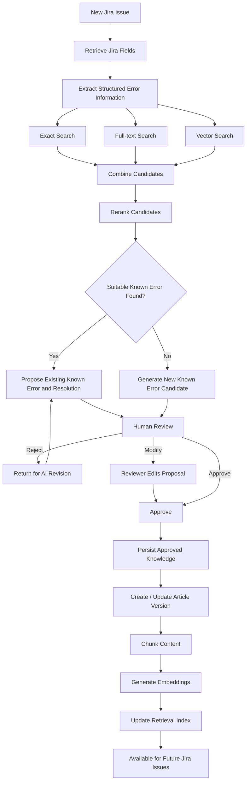
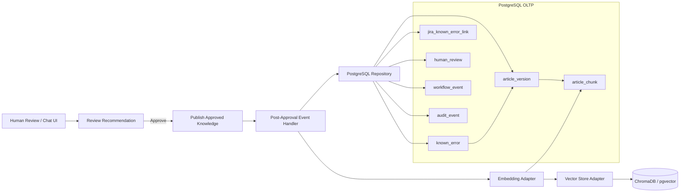
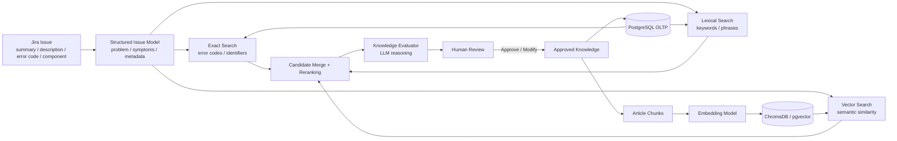
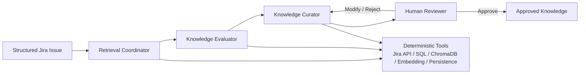

# Known Error DB Curator

Problem: It is often difficult to extract knowledge from resolved IT
incidents, solutions for recurring problems remain buried in an
unstructured ticket history. Attempts to manually identify and organise
this knowledge can lead to duplicate or outdated KEDB (Known Error
Database) articles, and useful information could end up not being saved
at all.

Objective: Develop an AI-assisted system that extracts reusable
knowledge from resolved IT incidents, identifies related existing KEDB
articles, and recommends whether knowledge should be added or updated,
while keeping the final decision under human review.

Scope: The system will process resolved IT incidents to extract reusable
information and compare it with existing KEDB articles. It will identify
related or potentially duplicate knowledge, recommend whether an
existing article should be updated or a new one created, and present
these recommendations for human review. Approved knowledge will be
structured, versioned and stored while maintaining traceability to its
source incident.

Assumptions: Resolved incident tickets are assumed to contain sufficient
information about the encountered problem and its resolution. The system
is assumed to have access to both resolved incidents and existing KEDB
articles, while qualified human reviewers are available to validate its
recommendations.

Exclusions: The system will not diagnose or resolve active IT incidents
and will not autonomously publish or modify KEDB articles without human
approval. Replacement of existing incident-management or
knowledge-management platforms is outside the scope of the project. The
system does not perform live ticket triage or routing and is not
intended to function as an ITSM ticketing tool. Integration with real
ITSM platforms such as ServiceNow or Jira is outside the scope of the
prototype; mock data will be used instead.

Understanding the process

The traditional method: After an IT incident is resolved, support
personnel manually review the ticket to identify reusable knowledge.
They search the existing KEDB for related known errors and determine
whether the resolution is already documented. If necessary, a new
article is created or an existing one is manually updated and reviewed.

Bottlenecks: The process relies heavily on manual review of unstructured
and inconsistently written ticket resolutions. Identifying reusable
knowledge and comparing it with existing articles is time-consuming,
while traditional keyword searches may fail to identify semantically
similar content. This can result in missed knowledge, duplicate or
outdated articles, and increasing maintenance effort as the volume of
incidents grows.

AI improvement: AI can automatically extract structured knowledge from
resolved incident tickets and use semantic similarity to identify
related existing KEDB articles beyond exact keyword matches. Based on
the retrieved information, the system can recommend whether new
knowledge should be added or an existing article updated, reducing
manual search and comparison effort. Human review remains responsible
for validating recommendations before any knowledge is approved.

## To Be flow

# High-level architecture

The application uses a modular monolith. The main capabilities - Jira
ingestion, retrieval, LangGraph orchestration, human review and
knowledge curation - live in one deployable application but remain
logically separated into modules. Clean Architecture principles are used
internally to keep domain and application logic independent from Jira,
the LLM provider, ChromaDB and PostgreSQL. PostgreSQL is explicitly the
OLTP system of record for approved operational knowledge.

``` mermaid
flowchart TB

    JIRA["External System<br/>Jira"]
    LLM["LLM Provider"]
    VECTOR[("ChromaDB / pgvector")]

    subgraph MODULAR["Modular Monolith"]

        subgraph PRESENTATION["Presentation Layer"]
            CHAT_UI["Ticket Resolution Chat UI"]
            REVIEW_UI["Knowledge Review UI"]
            API["FastAPI"]
        end

        subgraph APPLICATION["Application Layer"]

            CHAT_UC["Resolve Ticket via Chat"]
            PROCESS["Process Jira Issue"]

            LG["LangGraph Workflow Orchestrator"]

            SEARCH["Search Known Errors"]
            EVALUATE["Evaluate Candidates"]
            ANSWER["Generate Grounded Answer"]

            REVIEW["Review Recommendation"]
            PUBLISH["Publish Approved Knowledge"]
        end

        subgraph DOMAIN["Domain Layer"]

            ISSUE["JiraIssue"]
            CHAT_SESSION["ChatSession"]
            CANDIDATE["RetrievalCandidate"]

            KE["KnownError"]
            VERSION["ArticleVersion"]
            HUMAN["HumanReview"]

            RULES["Business Rules<br/>Retrieval Confidence<br/>Duplicate Decision<br/>Approval<br/>Versioning<br/>Publication"]
        end

        subgraph INFRASTRUCTURE["Infrastructure Layer"]

            JIRA_ADAPTER["Jira API Adapter"]
            DB_ADAPTER["PostgreSQL Repository"]
            VECTOR_ADAPTER["Vector Store Adapter"]
            LLM_ADAPTER["LLM Adapter"]
            EMBEDDING_ADAPTER["Embedding Adapter"]
            EVENT_HANDLER["Post-Approval Event Handler"]
        end
    end


    subgraph POSTGRES["PostgreSQL OLTP"]

        subgraph SOURCE_DATA["Jira & Traceability"]
            JIRA_ISSUE_DB["jira_issue"]
            JIRA_LINK_DB["jira_known_error_link"]
        end

        subgraph CHAT_DATA["Conversation State"]
            CHAT_SESSION_DB["chat_session"]
            CHAT_MESSAGE_DB["chat_message"]
            CHAT_RETRIEVAL_DB["chat_retrieval"]
        end

        subgraph KNOWLEDGE_DATA["Known Error Knowledge"]
            KNOWN_ERROR_DB["known_error"]
            ARTICLE_VERSION_DB["article_version"]
            ARTICLE_CHUNK_DB["article_chunk"]
        end

        subgraph RETRIEVAL_DATA["Retrieval History"]
            RET_SESSION_DB["retrieval_session"]
            RET_CANDIDATE_DB["retrieval_candidate"]
        end

        subgraph REVIEW_DATA["Human Review"]
            HUMAN_REVIEW_DB["human_review"]
        end

        subgraph DUPLICATE_DATA["Duplicate Management"]
            DUP_GROUP_DB["duplicate_group"]
            DUP_MEMBER_DB["duplicate_group_member"]
        end

        subgraph GOVERNANCE_DATA["Workflow & Audit"]
            WORKFLOW_DB["workflow_event"]
            AUDIT_DB["audit_event"]
        end

        subgraph EMBEDDING_META["Embedding Metadata"]
            EMB_MODEL_DB["embedding_model"]
            VECTOR_REF_DB["vector_reference"]
        end
    end


    %% External entry points
    JIRA --> JIRA_ADAPTER

    CHAT_UI --> API
    REVIEW_UI --> API

    %% Two primary use cases
    API --> CHAT_UC
    API --> PROCESS

    %% Shared orchestration
    CHAT_UC --> LG
    PROCESS --> LG

    LG --> SEARCH
    LG --> EVALUATE

    %% Chat resolution path
    EVALUATE --> ANSWER
    ANSWER --> CHAT_UI

    %% Knowledge curation path
    LG --> REVIEW
    LG --> PUBLISH

    REVIEW --> REVIEW_UI

    %% Domain
    CHAT_UC --> CHAT_SESSION
    PROCESS --> ISSUE

    SEARCH --> CANDIDATE
    EVALUATE --> CANDIDATE

    REVIEW --> HUMAN
    PUBLISH --> KE
    PUBLISH --> VERSION

    ISSUE --> RULES
    CANDIDATE --> RULES
    KE --> RULES
    VERSION --> RULES
    HUMAN --> RULES

    %% Infrastructure
    SEARCH --> DB_ADAPTER
    SEARCH --> VECTOR_ADAPTER

    EVALUATE --> LLM_ADAPTER
    ANSWER --> LLM_ADAPTER

    PROCESS --> JIRA_ADAPTER

    PUBLISH --> EVENT_HANDLER
    EVENT_HANDLER --> DB_ADAPTER
    EVENT_HANDLER --> EMBEDDING_ADAPTER

    EMBEDDING_ADAPTER --> VECTOR_ADAPTER

    %% External infrastructure
    LLM_ADAPTER --> LLM
    VECTOR_ADAPTER --> VECTOR
    DB_ADAPTER --> POSTGRES


    %% OLTP relationships
    JIRA_ISSUE_DB --> JIRA_LINK_DB
    KNOWN_ERROR_DB --> JIRA_LINK_DB

    JIRA_ISSUE_DB --> CHAT_SESSION_DB
    CHAT_SESSION_DB --> CHAT_MESSAGE_DB
    CHAT_MESSAGE_DB --> CHAT_RETRIEVAL_DB
    ARTICLE_VERSION_DB --> CHAT_RETRIEVAL_DB

    KNOWN_ERROR_DB --> ARTICLE_VERSION_DB
    ARTICLE_VERSION_DB --> ARTICLE_CHUNK_DB

    JIRA_ISSUE_DB --> RET_SESSION_DB
    RET_SESSION_DB --> RET_CANDIDATE_DB
    ARTICLE_VERSION_DB --> RET_CANDIDATE_DB

    RET_SESSION_DB --> HUMAN_REVIEW_DB
    KNOWN_ERROR_DB --> HUMAN_REVIEW_DB

    DUP_GROUP_DB --> DUP_MEMBER_DB
    JIRA_ISSUE_DB --> DUP_MEMBER_DB

    KNOWN_ERROR_DB --> WORKFLOW_DB
    ARTICLE_VERSION_DB --> WORKFLOW_DB

    ARTICLE_CHUNK_DB --> VECTOR_REF_DB
    EMB_MODEL_DB --> VECTOR_REF_DB
```

Figure 1. High-level modular monolith architecture with the OLTP layer
marked.

### OLTP architecture pipeline

After human approval, a `Publish Approved Knowledge` use case triggers the post-approval event handler. The handler persists the approved Known Error, its new article version, source linkage, review state, and workflow/audit records through the PostgreSQL repository. The approved article version is then divided into semantic chunks, processed by the embedding adapter, and indexed through the vector store adapter in ChromaDB or pgvector. The newly published knowledge then becomes available for future Jira retrieval.

Figure 2. OLTP persistence and indexing pipeline.

# Data design & RAG thinking

The system needs Jira issue data, approved Known Error content,
retrieval metadata and human-review outcomes. The minimum Jira data
includes issue key, summary, description, status, priority, component,
environment, comments and resolution information. Additional synthetic
fields such as error_code, root_cause, workaround and
application_version are useful for the proof of concept.

## Star schema for evaluation and reporting

The analytical star schema should focus on AI retrieval quality,
candidate accuracy, human validation and knowledge publication rather
than incident-volume reporting. The main facts are retrieval sessions,
retrieval candidates, human reviews and knowledge publication events.

```mermaid
erDiagram

    DIM_DATE {
        int date_key PK
        date full_date
        int month
        int quarter
        int year
    }

    DIM_PRODUCT {
        bigint product_key PK
        string product_name
        string product_version
        string product_family
    }

    DIM_ERROR_CATEGORY {
        bigint error_category_key PK
        string category_name
        string error_code
        string error_domain
    }

    DIM_KNOWN_ERROR {
        bigint known_error_key PK
        uuid known_error_id
        string article_key
        string title
        string status
    }

    DIM_ARTICLE_VERSION {
        bigint article_version_key PK
        bigint known_error_key FK
        int version_number
        string status
        boolean is_current
    }

    DIM_EMBEDDING_MODEL {
        bigint embedding_model_key PK
        string provider
        string model_name
        string model_version
        int dimensions
    }

    DIM_AGENT {
        bigint agent_key PK
        string agent_name
        string agent_version
        string graph_version
        string prompt_version
    }

    DIM_RETRIEVAL_METHOD {
        bigint retrieval_method_key PK
        string method_name
        string method_type
        string ranking_strategy
    }

    DIM_REVIEWER {
        bigint reviewer_key PK
        string reviewer_id
        string role
        string team
    }

    DIM_REVIEW_DECISION {
        bigint decision_key PK
        string decision_code
        string decision_name
    }

    FACT_RETRIEVAL_SESSION {
        bigint retrieval_session_fact_key PK
        uuid session_id
        int date_key FK
        bigint product_key FK
        bigint error_category_key FK
        bigint embedding_model_key FK
        bigint agent_key FK
        int candidate_count
        float top_score
        boolean match_found
        int latency_ms
    }

    FACT_RETRIEVAL_CANDIDATE {
        bigint candidate_fact_key PK
        uuid session_id
        bigint known_error_key FK
        bigint article_version_key FK
        bigint retrieval_method_key FK
        int candidate_rank
        float vector_score
        float lexical_score
        float final_score
        boolean correct_match
    }

    FACT_HUMAN_REVIEW {
        bigint review_fact_key PK
        uuid session_id
        bigint reviewer_key FK
        bigint decision_key FK
        bigint known_error_key FK
        bigint agent_key FK
        float ai_confidence
        boolean ai_match_correct
        boolean modified
        int review_duration_seconds
    }

    FACT_KNOWLEDGE_PUBLICATION {
        bigint publication_fact_key PK
        bigint known_error_key FK
        bigint article_version_key FK
        bigint reviewer_key FK
        bigint product_key FK
        int date_key FK
        boolean created_new_article
        boolean created_new_version
        int chunk_count
    }

    DIM_DATE ||--o{ FACT_RETRIEVAL_SESSION : date
    DIM_PRODUCT ||--o{ FACT_RETRIEVAL_SESSION : product
    DIM_ERROR_CATEGORY ||--o{ FACT_RETRIEVAL_SESSION : category
    DIM_EMBEDDING_MODEL ||--o{ FACT_RETRIEVAL_SESSION : embedding
    DIM_AGENT ||--o{ FACT_RETRIEVAL_SESSION : agent

    DIM_KNOWN_ERROR ||--o{ FACT_RETRIEVAL_CANDIDATE : candidate
    DIM_ARTICLE_VERSION ||--o{ FACT_RETRIEVAL_CANDIDATE : version
    DIM_RETRIEVAL_METHOD ||--o{ FACT_RETRIEVAL_CANDIDATE : method
    DIM_EMBEDDING_MODEL ||--o{ FACT_RETRIEVAL_CANDIDATE : embedding

    DIM_DATE ||--o{ FACT_HUMAN_REVIEW : date
    DIM_REVIEWER ||--o{ FACT_HUMAN_REVIEW : reviewer
    DIM_REVIEW_DECISION ||--o{ FACT_HUMAN_REVIEW : decision
    DIM_KNOWN_ERROR ||--o{ FACT_HUMAN_REVIEW : known_error
    DIM_AGENT ||--o{ FACT_HUMAN_REVIEW : agent

    DIM_DATE ||--o{ FACT_KNOWLEDGE_PUBLICATION : date
    DIM_KNOWN_ERROR ||--o{ FACT_KNOWLEDGE_PUBLICATION : article
    DIM_ARTICLE_VERSION ||--o{ FACT_KNOWLEDGE_PUBLICATION : version
    DIM_REVIEWER ||--o{ FACT_KNOWLEDGE_PUBLICATION : reviewer
    DIM_PRODUCT ||--o{ FACT_KNOWLEDGE_PUBLICATION : product

    DIM_KNOWN_ERROR ||--o{ DIM_ARTICLE_VERSION : versions
```

Figure 3. Star schema for retrieval, review and publication evaluation.

## Entities tables

| Entity             | Purpose                                                      |
|--------------------|--------------------------------------------------------------|
| JiraIssue          | Normalized source issue used for retrieval and traceability. |
| KnownError         | Stable identity of an approved known error.                  |
| ArticleVersion     | Versioned Known Error content.                               |
| ArticleChunk       | Semantic section used for vector retrieval.                  |
| RetrievalSession   | One retrieval/evaluation run.                                |
| RetrievalCandidate | Candidate article and its exact/lexical/vector scores.       |
| HumanReview        | Approve/modify/reject decision.                              |
| Embedding          | Vector representation of a chunk.                            |
| AuditEvent         | Traceability for changes and decisions.                      |

## Mock data strategy

Generate approximately 10,000 synthetic Jira issues using controlled
templates rather than fully random text. Keep ground-truth identifiers
so retrieval quality can be evaluated.

- About 70% unique issues.

- About 20% semantic duplicates with different wording.

- About 5% exact or near-exact duplicates.

- About 5% ambiguous related-but-not-duplicate cases.

- Store ground_truth_error_group and ground_truth_known_error where
  applicable.

## RAG and ChromaDB usage

Retrieval should be hybrid: exact search for identifiers and error
codes, lexical search for strong keyword overlap, and ChromaDB vector
search for semantically similar errors. Retrieved candidates are merged
and reranked before the LLM evaluates them. Only approved Known Error
article chunks are embedded and added to ChromaDB so unverified
AI-generated content does not contaminate future retrieval.

Figure 4. Data and hybrid RAG flow.

# Agent structure

The design keeps agent responsibilities broad. LangGraph coordinates a
small number of reasoning roles, while deterministic operations remain
tools. This keeps the workflow understandable and prevents unnecessary
agent complexity.

Figure 5. High-level agent responsibilities.

| Agent                 | Role                                                                                                                                                 |
|-----------------------|------------------------------------------------------------------------------------------------------------------------------------------------------|
| Retrieval Coordinator | Interprets the Jira issue, decides which retrieval tools are needed, and gathers the candidate Known Errors.                                         |
| Knowledge Evaluator   | Compares the Jira issue with retrieved evidence and determines whether an existing Known Error is a reliable match or whether a new one is required. |
| Knowledge Curator     | Produces the reusable resolution or new Known Error candidate and revises it when the human reviewer requests changes.                               |

The Jira API, SQL queries, ChromaDB search, embedding generation,
persistence and audit logging remain deterministic tools rather than
separate agents. A human reviewer remains the mandatory control point
before new or modified knowledge is persisted.

# Success criteria

A metric called F1 Score will be used to evaluate how well structured knowledge is extracted from resolved incident tickets. F1 is determined by the following formula:

$F_1 = 2 \times \left(\dfrac{\text{Precision} \times \text{Recall}}{\text{Precision} + \text{Recall}}\right)$

Where Precison measures how many of the extracted fields are correct (extracted info matches ground truth) and recall is how many of the fields that should have been extracted were identified. F1 will be a number between 0 and 1 where higher values indicate better performance. For this, a dataset of resolved incident tickets with human labelled ground truth will be created, with expected fields to be extracted such as: problem, root cause, solution. Precision, Recall and F1 will be calculated with this test set, to evaluate whether the model sucessfully extracted information for all fields, and if the extracted information matches the ground truth.

F1 evaluates the system’s ability to correctly extract information from the resolved incident tickets. However, it is also necessary to evaluate the systems ability to identify to find existing solutions in the KEDB. For this a metric called Recall@k will be utilised. This metric evaluates whether an incident (which has an KEDB entry) appears in the top k results. For k=5 the formula can be written as:

$\text{Recall@5} = \dfrac{\text{incidents where relevant entry is in top 5 results}}{\text{total incidents with a known entry}}$

For example, we have a mock KEDB with 20 entries, we ttempt to find each incident in the database, resulting in 16 successes (the incident we were looking for appeared in the top 5 results) and 4 failures (the incident did not appear in the top 5 results, even though it does exist in the database). This would mean a 0.8 or 80% success rate.
